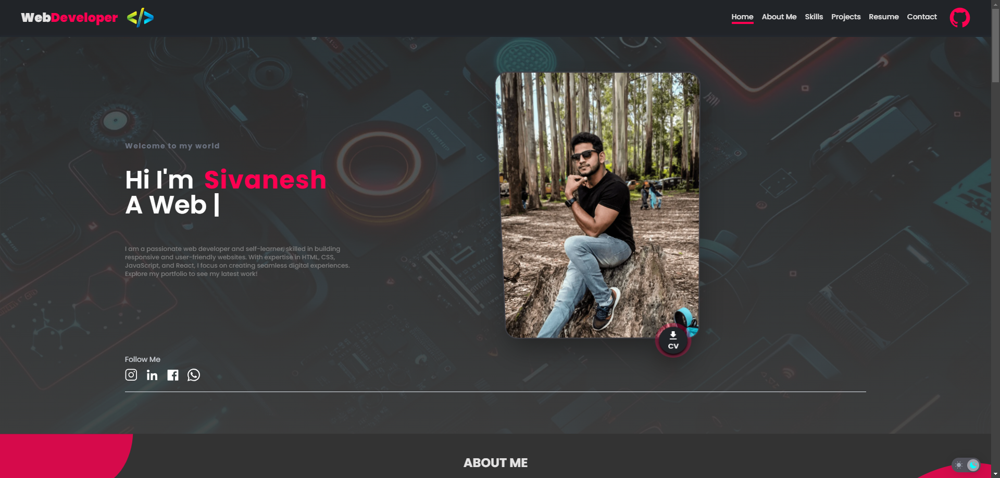
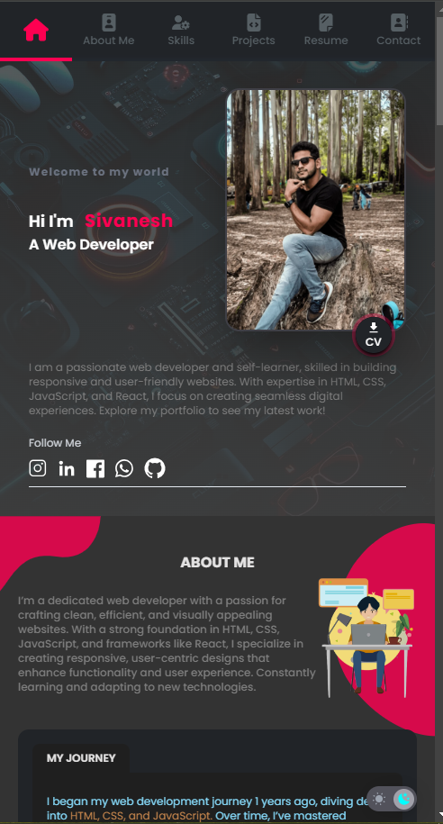
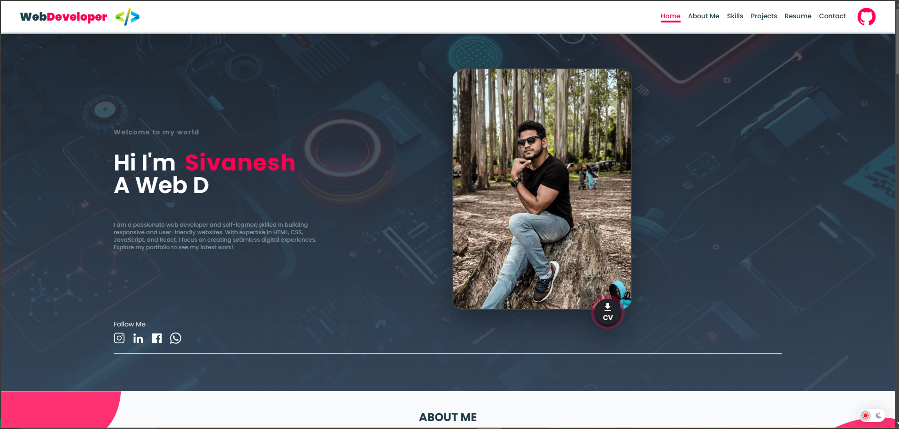

# Portfolio Website

Welcome to my personal portfolio website! This project showcases my skills, projects, and experiences in web development, design, and more. Built using modern web technologies, it’s designed to be both visually appealing and highly responsive.

## Dark Mode
 

## Light Mode

## > Live Link: [https://sivaneshkkf.github.io/Portfolio/](https://sivaneshkkf.github.io/Portfolio/)

## 🛠️ Technologies Used
Frontend: React, Tailwind CSS, Framer Motion (for animations), Vite
Hosting: GitHub Pages
Additional Libraries: react-blurhash for image placeholders, framer-motion for animations, React-hook-form, Schema-validation (zod)

## ✨ Features

## Responsive Design: 
Adjusts beautifully across all device sizes, from desktops to mobiles.

## Animated UI Elements: 
Enhanced interactivity using smooth animations.
Dynamic Content: Projects, experience, and skills sections update with ease.

## Theme
Dark and light theme modes with adaptive colors provide an engaging, visually tailored experience for each theme.

## Performance Optimizations: 
Fast load times with optimized images and efficient code.

